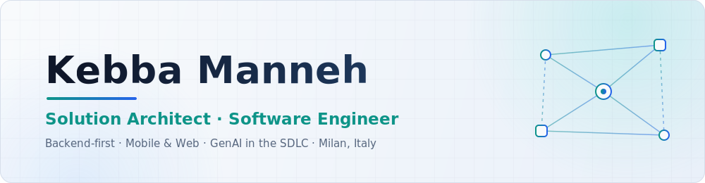
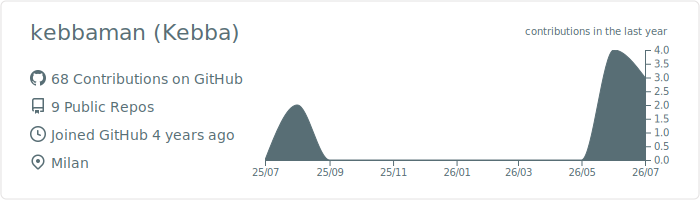
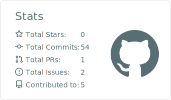
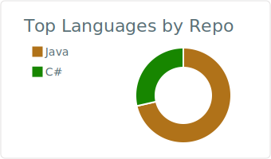

<!-- Profile README · kebbaman/kebbaman -->

<picture>
  <source media="(prefers-color-scheme: dark)" srcset="assets/banner-dark.svg">
  
</picture>

  
  
  

## 🧭 About me

Hi, I'm **Kebba** — Solution Architect & Software Engineer at one of Italy's largest banks, based in Milan.

- 🤖 Currently on the team bringing **generative AI into the bank's software development lifecycle** — rethinking how an enterprise designs, writes, reviews and ships software
- ⚙️ **Backend-first**: Java, Spring Boot, Kafka — event-driven and microservice architectures at enterprise scale
- 📱 I also ship **mobile apps** (Kotlin · Jetpack Compose, React Native) and **web frontends** (React)
- 🧩 Open-source contributor to **Spring Batch Extensions**
- 🛠️ Off the clock I design, build and ship real products end-to-end — **DChoice** and **Travelbuddy** below

## 🚀 Featured work

<table>
  <tr>
    <td width="50%" valign="top">
      <h3>🗳️ DChoice&nbsp;&nbsp;</h3>
      
A group outing planner that takes the <i>“so… where are we going?”</i> out of hanging out. Friends create groups, propose outings and vote on times &amp; places — with live results over WebSocket and location-aware place suggestions.

      

        <b>Android</b> — Kotlin · Jetpack Compose · Coroutines/Flow · Hilt · Retrofit · Room · Firebase (Auth, FCM, Crashlytics) · Google Maps · multi-module Clean Architecture  
        <b>Backend</b> — Java 21 · Spring Boot · PostgreSQL + Flyway · STOMP over WebSocket · Firebase Admin · Google Maps API · multi-module Maven · Railway
      

    </td>
    <td width="50%" valign="top">
      <h3>✈️ Travelbuddy&nbsp;&nbsp;</h3>
      
An AI-powered travel planner: set your trip preferences and get a personalized day-by-day itinerary, enriched with real POI data — ratings, opening hours, booking links — plus Google Directions-powered transit &amp; navigation.

      

        <b>Stack</b> — React Native · Expo · TypeScript · Zustand · React Query · RevenueCat
      

    </td>
  </tr>
  <tr>
    <td width="50%" valign="top">
      <h3>🧩 Spring Batch Extensions&nbsp;&nbsp;</h3>
      
Contributed a <b>streaming ItemReader for legacy <code>.xls</code> files</b> to <code>spring-batch-excel</code> — constant-memory reads of large legacy Excel workbooks in batch pipelines. Merged upstream in <code>spring-batch-excel 0.3.1</code>.

      

        <b>Stack</b> — Java · Spring Batch · Apache POI &nbsp;·&nbsp; <a href="https://github.com/spring-projects/spring-batch-extensions/pull/216">PR #216 →</a>
      

    </td>
    <td width="50%" valign="top">
      <h3>⚖️ Client-side load balancing demo&nbsp;&nbsp;</h3>
      
A hands-on demo of <b>client-side load balancing</b> between Spring Boot services with Spring Cloud LoadBalancer — the pattern, the trade-offs, and running code.

      

        <b>Stack</b> — Java · Spring Boot · Spring Cloud &nbsp;·&nbsp; <a href="https://github.com/kebbaman/spring-client-side-load-balancing-demo">Repository →</a>
      

    </td>
  </tr>
</table>

## 🛠️ Tech stack

<table>
  <tr>
    <td align="right"><b>Backend</b></td>
    <td>
      
      
      
      
      
      
      
      
    </td>
  </tr>
  <tr>
    <td align="right"><b>Mobile</b></td>
    <td>
      
      
      
      
      
    </td>
  </tr>
  <tr>
    <td align="right"><b>Frontend</b></td>
    <td>
      
      
    </td>
  </tr>
  <tr>
    <td align="right"><b>AI&nbsp;&amp;&nbsp;SDLC</b></td>
    <td>
      
      
      
    </td>
  </tr>
  <tr>
    <td align="right"><b>Cloud&nbsp;&amp;&nbsp;Tools</b></td>
    <td>
      
      
      
      
      
      
    </td>
  </tr>
</table>

## 📊 GitHub analytics

<picture>
  <source media="(prefers-color-scheme: dark)" srcset="profile-summary-card-output/github_dark/0-profile-details.svg">
  
</picture>

<picture>
  <source media="(prefers-color-scheme: dark)" srcset="profile-summary-card-output/github_dark/3-stats.svg">
  
</picture>
<picture>
  <source media="(prefers-color-scheme: dark)" srcset="profile-summary-card-output/github_dark/1-repos-per-language.svg">
  
</picture>

<picture>
  <source media="(prefers-color-scheme: dark)" srcset="https://streak-stats.demolab.com/?user=kebbaman&theme=github-dark-blue&hide_border=true&background=00000000">
  
</picture>

---

Always up for a good architecture conversation — <a href="https://www.linkedin.com/in/kebbamanneh">find me on LinkedIn</a> 🤝

